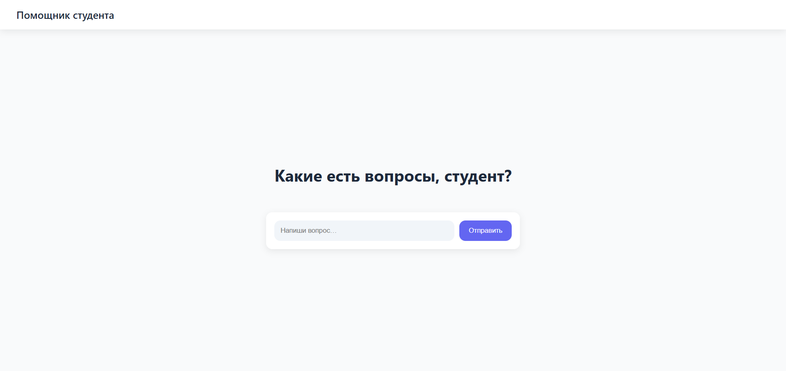
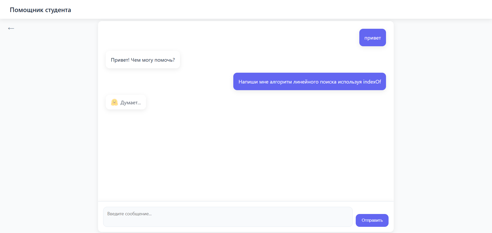
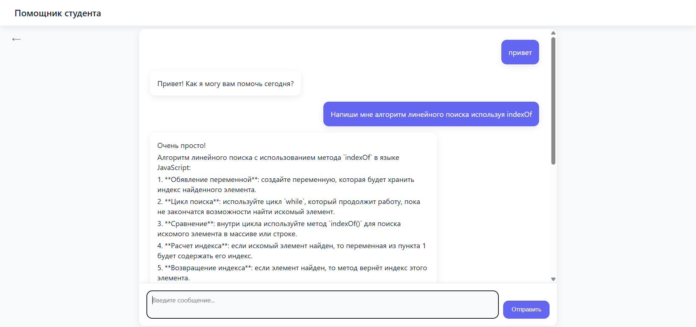

# Помощник студента

Проект представляет собой обучающую систему в формате чат-бота для студентов и начинающих разработчиков.  
Цель проекта — сделать процесс изучения языков программирования и веб-разработки доступным, интерактивным и интуитивным.

---

## Назначение проекта
Система предназначена для помощи студентам в изучении основ программирования и решении учебных задач.  
Платформа имитирует работу умного ассистента, способного отвечать на вопросы, объяснять концепции и помогать с кодом.  
Проект выполнен с акцентом на простоту интерфейса и качество взаимодействия пользователя с системой.

---

## Описание реализации
В основе проекта — современная фронтенд-архитектура на фреймворке **React**, с выделенными компонентами и страницами:
- `Home` — стартовая страница с вводом вопроса;
- `Chat` — интерактивная страница общения с ассистентом;
- `Layout` — общий шаблон интерфейса.

Бэкенд построен на **Node.js** с использованием **Express**.  
Настроен API-эндпоинт `/api/chat`, обрабатывающий пользовательские запросы и формирующий ответ от интеллектуальной модели.  
Приложение запускается локально на порту `3000`.

---

## Скриншоты интерфейса

### Главная страница

### Состояние ожидания ответа

### Страница чата

## Основные возможности
- диалоговый интерфейс с поддержкой длинных сообщений;
- адаптивный дизайн и стабильный скроллинг внутри чата;
- понятная структура кода и простое подключение к серверу;
- система отображения состояния ожидания ("думает...") при загрузке ответа.

---

## Целевая аудитория
- студенты вузов и колледжей, изучающие программирование;
- начинающие разработчики, осваивающие web-технологии;
- преподаватели, использующие интерактивные инструменты обучения.

---

## Этап реализации
Проект переведён с базового стека **HTML / CSS / JavaScript** на современный фреймворк **React**.  
Реализована интеграция с сервером, структура компонентов и пользовательский интерфейс.  
Приложение стабильно запускается локально и готово к расширению.

